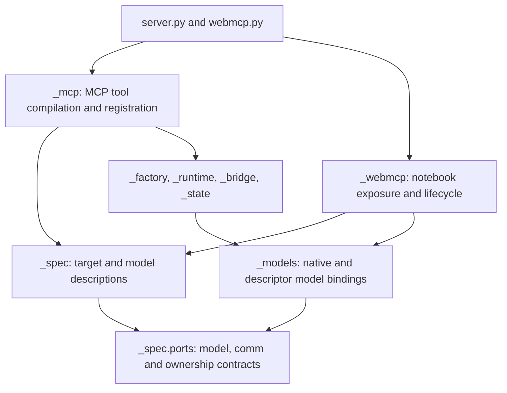

# Widget specifications

`_spec.scan()` describes an [AnyWidget](https://anywidget.dev/), a Python-backed
browser widget, from an instance, class, or creation function before registration.
`_spec.compile_inputs()` adds an argument contract through a compiler port.
These definitions feed [MCP Apps](https://modelcontextprotocol.io/extensions/apps/overview),
which render widgets inside AI conversations, and
[WebMCP](https://webmachinelearning.github.io/webmcp/), which publishes browser
tools. CLI inspection, model bindings, and state selection consume the same facts.

```python
import anywidget
import traitlets as t

from anywidget_mcp._spec import compile_inputs, scan


class Counter(anywidget.AnyWidget):
    value = t.Int(0, min=0, help="Current count").tag(sync=True)


def create_counter(start: int = 2) -> Counter:
    return Counter(value=start)


spec = scan(create_counter)
inputs = compile_inputs(spec)

assert spec.kind == "factory"
assert spec.call.result.widget_type is Counter
assert spec.model.default_state_names == ("value",)
assert inputs.validate({"start": 4}) == {"start": 4}
assert spec.model.trait("value").input_schema.to_dict() == {
    "type": "integer",
    "minimum": 0,
    "description": "Current count",
}
```

Scanning resolves parameter annotations, records declared result information,
and inspects trait definitions. Widget construction, factory execution, context
manager entry, descriptor binding, and observer registration happen during
acquisition or model binding.

## Dependency direction



`_spec/types.py` and `_spec/ports.py` depend on Python's standard library. The
standard source inspector and trait schema compiler adapt AnyWidget and
[traitlets](https://traitlets.readthedocs.io/en/stable/), the validated Python
attribute library, into those records. `_spec` imports its own modules and source
libraries. Transport libraries and runtime owners depend inward on that boundary.
`test_spec_boundaries.py` checks this direction, including imports inside
`TYPE_CHECKING` blocks.

## Intermediate representation

| Record         | Facts retained                                                                                                      |
| -------------- | ------------------------------------------------------------------------------------------------------------------- |
| `TargetSpec`   | Source, instance/class/factory kind, identity, callable definition, known model, declared capabilities              |
| `Identity`     | Python name, canonical tool name, title, direct description                                                         |
| `CallableSpec` | Creation callable, resolved Python signature, parameters and defaults, asynchronous declaration, result information |
| `ResultSpec`   | Return annotation, known widget class, single/sequence cardinality, managed acquisition information                 |
| `ModelSpec`    | Complete trait inventory, synchronized names, default-visible names, observation and read/write eligibility         |
| `TraitSpec`    | Type, help, default, metadata, synchronization, mutability, nullability, schema, write restriction                  |
| `InputSpec`    | Compiled signature, JSON schema, argument validator and converter                                                   |

A class has declared traits. A factory can contribute a model description when
its return annotation identifies a widget class. An unresolved return annotation
remains recorded and advisory. The runtime checks the returned value and describes
its actual instance after acquisition. This includes dynamically added traits.

`JsonSchema` stores an immutable schema document. `to_dict()` exports a fresh
ordinary JSON-compatible dictionary. Metadata and default containers are frozen
when inspected. A `ValueReference` records a cycle back to an ancestor container,
so unrelated cyclic metadata can be retained during inspection.

## Facts and exposure policy

The trait inventories serve different operations:

| Inventory              | Consumer                                                       |
| ---------------------- | -------------------------------------------------------------- |
| All declared traits    | Explicit state selections and configuration validation         |
| Synchronized traits    | Widget graph traversal and wire-state membership               |
| Default-visible traits | Default MCP model context and the starting WebMCP exposure set |
| Observable traits      | Projection invalidation and mutation guards                    |
| JSON-writable traits   | Conservative input eligibility before integration policy       |

Default-visible traits are synchronized, have public names, and exclude the
framework fields `layout`, `tabbable`, and `tooltip`. Native synchronization uses
declared trait metadata, matching the native widget protocol. Instance serializer
overrides are resolved separately through `trait_metadata()`.

A trait schema of `{}` permits unconstrained JSON inputs. A missing schema means
that inference cannot establish an input contract. Read-only traits, custom
serialization, unsynchronized traits, and unsupported input types retain distinct
write restrictions. Native validators and the bound comm's direction remain
responsible for accepting actual updates.

WebMCP's `private`, `traits`, `read_only`, and `webmcp=False` settings are exposure
policy applied to `ModelSpec`. MCP Apps independently applies its `state=` policy.
A WebMCP privacy flag therefore leaves the same trait available to an explicit
MCP state projection. `test_spec_consumers.py` checks this distinction through
both integrations.

## Compilation and execution ports

`SourceInspector` is a function from a source object to `TargetSpec`. The default
inspector handles Python widget sources. Passing an inspector to `scan()` allows
another source representation to produce the same records. `TargetSpec.source`
retains that source for provenance, while `CallableSpec.invoke` supplies creation.
An integration executes the declared callable, so a declarative source object can
remain data throughout compilation and registration.

`InputCompiler` is a function from `CallableSpec` to `InputSpec`. The default
`json_inputs` compiler validates typed finite JSON values and converts enum
members. MCP Apps supplies a compiler that retains the MCP SDK's [Pydantic](https://docs.pydantic.dev/latest/)
typed input validation, injected `Context` and resolver parameters, and typed nested values.
It also adds the app's `loading_message` input. That field belongs to the MCP
contract, while the shared source signature stays unchanged.

MCP compilation returns its native SDK tool together with the shared input
contract. Registration copies that tool with a runtime invocation callback and
app metadata. CLI preflight retains the same compiled definition for subsequent
registration. The compiled definition can be registered against independent
server runtimes.

`ModelBinding` supplies identity, descriptions, current synchronized values,
observation, reading, committed-value serialization, comm connection, state
emission, and cleanup. `_models.bind_model()` selects the native AnyWidget or
descriptor-backed implementation. Descriptor resolution is effectful and belongs
to binding. The owning runtime retains its controller cache.

`CommPort` describes the connection a model can use. MCP Apps explicitly connects
models to `BridgeComm`. WebMCP reads through model bindings while retaining the
notebook connection. `OwnedSession` gives managed factory acquisition the cleanup
operation it needs independently of the concrete bridge session.

## Runtime responsibilities

The specification describes source facts. These owners maintain live state:

| Owner                   | Responsibility                                                                       |
| ----------------------- | ------------------------------------------------------------------------------------ |
| `_mcp/targets.py`       | MCP argument compilation, injected and synthetic inputs, tool metadata, registration |
| `_webmcp/policy.py`     | Instance exposure selection and normalized configuration                             |
| `_webmcp/session.py`    | Notebook registrations, creation requests, replay and owned widgets                  |
| `_webmcp/instrument.py` | Source wrapping, native message handling and descriptor publication                  |
| `_models.py`            | Native and descriptor model operations                                               |
| `_widget_protocol.py`   | Recursive references, graph discovery, identity claims and cleanup eligibility       |
| `_factory.py`           | Direct/awaitable/managed acquisition and ordered result ownership                    |
| `_bridge.py`            | Enrollment, canonical snapshots, graph replacement and delivery                      |
| `_state.py`             | Observers, last-notified values, projection guards and versions                      |
| `_projection_json.py`   | Bounded serialization of runtime values                                              |

State projection serializes the last notified values through the live model
binding. Builtin dict, list, and tuple structure is retained with `copy.deepcopy()`, while widget and opaque leaf identities stay intact. Native
`send_state()` advances the committed values for the emitted traits. Callable
projectors are checked against the retained container structure as well as trait
notifications.

Scanning never replaces those values with a class default. Graph traversal reads
current synchronized values through the binding's native `trait_values(sync=True)`
operation each time membership is reconciled.

## Native library contracts

The Python adapters use traitlets `class_traits()`, `traits()`, `trait_values()`,
`trait_metadata()`, `observe()`, and `unobserve()`. Widget updates use native
`set_state()` and its validation, cross-validation, and notification batching.
Descriptor-backed models use AnyWidget's `MimeBundleDescriptor` and
`ReprMimeBundle` for binding, state getters/setters, synchronization, and cleanup.

Traitlets batching restores `notify_change` from the class. The session installs
its notification dispatch on a native instance-local subclass created through
`HasTraits.add_traits()`, so batching preserves the dispatch and class peers
remain independent. Teardown removes that dispatch while preserving traits added
during the session.

The browser imports the public `@anywidget/types` contracts for the
[AnyWidget front-end module interface](https://anywidget.dev/en/afm/).
Initializer exports retain their object identity, including class instances and
collections. Hook getters run at their lifecycle phase with the definition as
their receiver. Child acquisition observes cancellation and a ten-second
initialization deadline.

Traitlets supplies value validation and metadata, while the specification layer
translates those declarations into JSON Schema. Its `signature_has_traits()`
utility supplies autocomplete parameters rather than typed tool contracts.
Creation tools use the callable's explicit signature. Session projections,
protocol delivery, graph claims, and source-cache ownership remain integration
responsibilities.

## Validation

The Python suite covers source and schema extension ports, native and descriptor
bindings, immutable schema exports, dynamic traits, custom codecs, managed
factories, SDK validation, and exposure-policy independence. Run `make check` for
those contracts, dependency checks, packaging, and the browser matrix.

Native Chromium scenarios exercise real WebMCP in JupyterLab, marimo, and the MCP
App host. They cover creation, interaction, notebook-client isolation, cell
reruns, and kernel shutdown. See [Development](development.md) for setup and
scoped commands.
